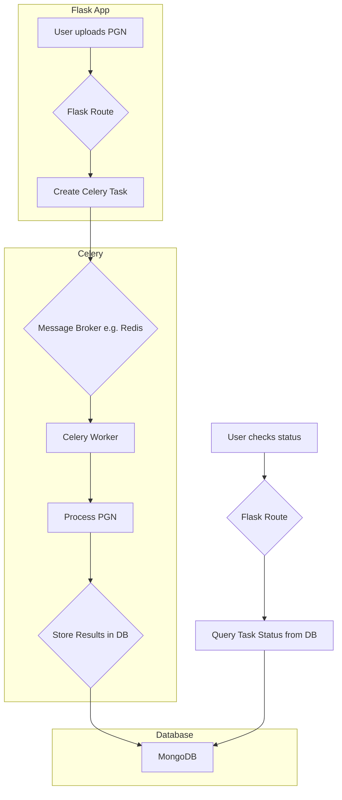

# Refactoring & Improvement Plan

This document outlines a plan to refactor the ChessClub AI Assistant application. The primary goals are to improve code organization, reduce complexity, and establish a more maintainable and scalable architecture.

## 1. Backend Refactoring with Flask Blueprints

The main `flask_app.py` file is a monolith containing all routes and application logic. By breaking it into **Blueprints**, we can group related functionality into separate modules.

### Proposed Structure

I suggest creating a new `app` directory to house the refactored application.

```
/
|-- app/
|   |-- __init__.py         # Application factory (create_app)
|   |-- main/               # Core routes (home, play)
|   |   |-- __init__.py
|   |   `-- routes.py
|   |-- api/                # All API endpoints
|   |   |-- __init__.py
|   |   `-- routes.py
|   |-- library/            # Library, openings, and upload routes
|   |   |-- __init__.py
|   |   `-- routes.py
|   |-- auth/               # Authentication routes (login, logoff)
|   |   |-- __init__.py
|   |   `-- routes.py
|   |-- static/             # (move existing static folder here)
|   `-- templates/          # (move existing templates folder here)
|-- chess_engine.py
|-- requirements.txt
|-- run.py                  # New file to run the application
|-- config.py               # New file for configuration
... (other project files)
```

### Mermaid Diagram of Proposed Architecture

```mermaid
graph TD
    A[run.py] --> B(Create App);
    B --> C{Flask App};
    C --> D[main Blueprint];
    C --> E[api Blueprint];
    C --> F[library Blueprint];
    C --> G[auth Blueprint];

    subgraph "app/main"
        D --> D1[/startup];
        D --> D2[/play];
    end

    subgraph "app/api"
        E --> E1[/move];
        E --> E2[/eval];
        E --> E3[/api/...];
    end

    subgraph "app/library"
        F --> F1[/library];
        F --> F2[/openings];
        F --> F3[/upload];
    end

    subgraph "app/auth"
        G --> G1[/login];
        G --> G2[/logoff];
    end
```

## 2. Frontend Refactoring

The frontend can be significantly improved by standardizing templates and modularizing JavaScript.

### Template Inheritance

The `index.html` and `library.html` templates should extend `base.html` to avoid duplicating the navbar, sidebar, and basic page structure.

**Example (`index.html`):**

```html


Play Chess


    {{ super() }}
    <!-- Add page-specific CSS and JS links here -->
    <link rel="stylesheet" href="{{ url_for('static', filename='libs/chessboard/css/chessboard-0.3.0.css') }}">



    <!-- All the content specific to the play page goes here -->
    <div class="play-container">
        ...
    </div>

```

### JavaScript Modularization

The `static/scripts.js` file (1800+ lines) should be broken down into smaller, feature-focused files. This improves readability and makes the code easier to manage.

**Proposed JS file structure:**

*   `static/js/main.js`: Global setup, sidebar logic.
*   `static/js/board.js`: All chessboard.js setup, interaction logic (`onDrop`, `onDragStart`), and highlighting.
*   `static/js/game.js`: Game state management (`updateStatus`), API calls for moves/eval, UI updates for status, PGN table.
*   `static/js/library.js`: Logic specific to the library page.
*   `static/js/api.js`: A dedicated module for all `fetch` or `$.ajax` calls to the backend API.

## 3. Configuration Management

Hardcoded values like the secret key and database connection details should be moved out of the application code.

Create a `config.py` file:

```python
# config.py
import os

class Config:
    SECRET_KEY = os.environ.get('SECRET_KEY') or 'a-default-secret-key-for-development'
    MONGO_URI = os.environ.get('MONGO_URI') or 'mongodb://localhost:27017/chessclub'
```

The application factory in `app/__init__.py` would then load this configuration.

## 4. Dependency Cleanup

The `requirements.txt` file should be updated to reflect the actual dependencies. The `Flask-Menu` package is no longer used and should be removed.
## 5. Background Task Handling with Celery

Long-running tasks like PGN processing are currently handled with Python's `threading` module and in-memory dictionaries. This approach is not scalable and will lose all job data if the application restarts.

A more robust solution is to use a dedicated task queue like **Celery** with a message broker like **Redis** or **RabbitMQ**.

### Benefits of Celery

*   **Persistence**: Tasks and their states are stored in a persistent backend (e.g., Redis or the MongoDB database), so they are not lost on restart.
*   **Scalability**: You can run multiple Celery workers to process tasks in parallel, distributing the load.
*   **Monitoring**: Celery provides tools for monitoring task progress and results.

### Mermaid Diagram of Proposed Task Queue


## 6. How to Run the Application

To run the ChessClub AI Assistant, you will need to set up the environment and install the required dependencies.

### Prerequisites

1.  **Python 3**: Ensure you have Python 3 installed.
2.  **MongoDB**: You need a running instance of MongoDB on `localhost:27017`.
3.  **Stockfish Engine**: The application expects the Stockfish executable to be located at `stockfish/stockfish.exe`. Make sure this file exists.

### Setup and Execution Steps

1.  **Create a Virtual Environment** (Recommended):
    ```bash
    python -m venv venv
    source venv/bin/activate  # On Windows, use `venv\Scripts\activate`
    ```

2.  **Install Dependencies**:
    Install all the required packages from the `requirements.txt` file.
    ```bash
    pip install -r requirements.txt
    ```

3.  **Run the Application**:
    Execute the main Flask application file.
    ```bash
    python flask_app.py
    ```

4.  **Access the Application**:
    Open your web browser and navigate to `http://127.0.0.1:5000`.
## 7. Testing Strategy

A robust testing suite is crucial for maintaining code quality and preventing regressions. I recommend using the **pytest** framework for its simplicity and powerful features.

### Test Structure

All tests should be placed in a dedicated `tests/` directory at the root of the project.

```
/
|-- tests/
|   |-- __init__.py
|   |-- test_api.py         # Tests for the API endpoints
|   |-- test_main.py        # Tests for core application routes
|   |-- test_library.py     # Tests for the library functionality
|   |-- test_chess_engine.py # Unit tests for the chess engine logic
|   `-- conftest.py         # Fixtures for test setup (e.g., app client)
... (other project files)
```

### Types of Tests

1.  **Unit Tests**: These will test individual functions and classes in isolation. For example, we can write unit tests for the `chess_engine.py` logic and for helper functions in the Flask application.
2.  **Integration Tests**: These will test how different parts of the application work together. For example, we can test the full request-response cycle for each Flask route, ensuring that the correct templates are rendered and the database is updated as expected.
3.  **End-to-End (E2E) Tests**: These tests simulate a real user interacting with the application in a browser. Tools like **Selenium** or **Playwright** can be used to automate browser actions and verify that the UI behaves correctly.

### Tools and Libraries

*   **`pytest`**: The core testing framework.
*   **`pytest-flask`**: Provides helpful fixtures for testing Flask applications (e.g., a test client).
*   **`pytest-mock`**: Allows for easy mocking of external services like the MongoDB database or the Stockfish engine, so you can test your application logic without relying on these external dependencies.
*   **`pytest-cov`**: Measures your test coverage, helping you identify parts of your codebase that are not yet covered by tests.

### Example Test (`tests/test_main.py`)

```python
def test_home_page(client):
    """
    GIVEN a Flask application configured for testing
    WHEN the '/' page is requested (GET)
    THEN check that the response is valid
    """
    response = client.get('/')
    assert response.status_code == 200
    assert b"ChessClub AI Assistant" in response.data
    assert b"Login" in response.data
```